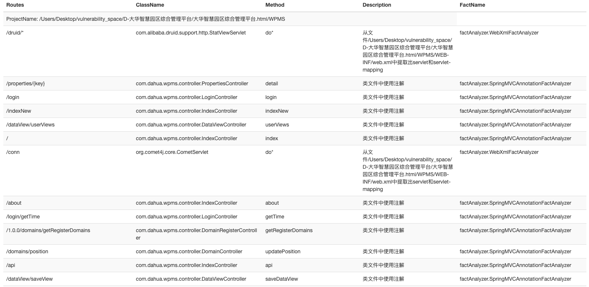
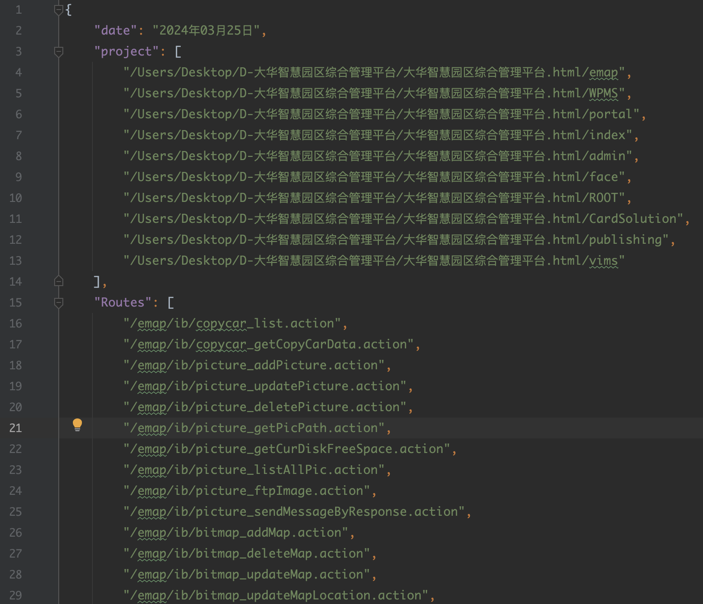

2023年初我和@suizhibo完成了RouteCheck的雏形，目的是用于分析和提取源码中所有的访问路由。
近期我将对RouteCheck进一步打磨，让它成为好用的代码审计工具。
争取在四月底之前完工，然后更新RouteCheck的开发文档和使用说明。

# Usage

```text
.______        ______    __    __  .___________. _______   ______  __    __   _______   ______  __  ___ 
|   _  \      /  __  \  |  |  |  | |           ||   ____| /      ||  |  |  | |   ____| /      ||  |/  / 
|  |_)  |    |  |  |  | |  |  |  | `---|  |----`|  |__   |  ,----'|  |__|  | |  |__   |  ,----'|  '  /  
|      /     |  |  |  | |  |  |  |     |  |     |   __|  |  |     |   __   | |   __|  |  |     |    <   
|  |\  \----.|  `--'  | |  `--'  |     |  |     |  |____ |  `----.|  |  |  | |  |____ |  `----.|  .  \  
| _| `._____| \______/   \______/      |__|     |_______| \______||__|  |__| |_______| \______||__|\__\ 
                                                                                                        
usage: java -jar RouteCheck.jar [-cp <arg>] [-h] [-lp <arg>] [-o <arg>] [-pn
       <arg>] [-pp <arg>] [-sp <arg>]
 -cp,--class-path <arg>     类文件地址
 -h,--help                  打印命令行帮助信息
 -lp,--lib-path <arg>       库文件地址
 -o,--outPut <arg>          结果保存目录
 -pn,--project-name <arg>   项目名称
 -pp,--project-path <arg>   项目路径
 -sp,--setting-path <arg>   设置文件地址
```
Default Usage
```text
 java -jar RouteCheck.jar -pp /Users/axisx/Download/project
```
Only `-pp` parameter is mandatory, All other parameters are optional. If `-lp` or `-cp` parameter is not specified, RouteCheck will automatically extract it from the project.


RouteCheck supports two output formats: HTML and JSON.

HTML


JSON


